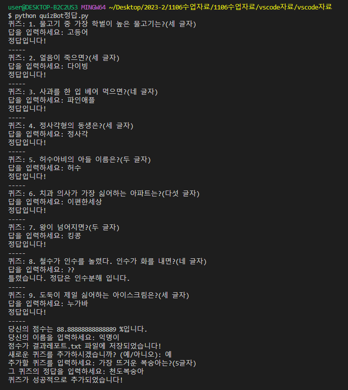

**자료 설명**
고등학교 정보 교과 수업 시연을 위하여 제작하였으며, '알고리즘과 프로그래밍' 단원의 PBL 수업 용도이다. 이 외에도 학습지 등의 파일이 있다.

**예시 실행 결과**

**수업 후기 공유 영상 멘트 중 일부**
학생들은 PBL수업에서 넌센스 퀴즈봇을 제작했습니다.

넌센스 퀴즈봇의 기능은 다섯 가지로 세분화되며,
각 단계별로, 자세한 주석과 함께 스켈레톤 코드를 제공하였습니다.
또한 학생들이 참고할 수 있도록 개념 복습 단계에서 사용한 수업 자료들을 text 파일과 학습지로 제공하였습니다.

완성된 코드를 실행해보겠습니다.
다음과 같이 문제가 나오며, 답을 입력할 수 있습니다.
문제를 다 풀면, 결과 레포트를 받고 문제를 추가할 수도 있습니다.

이후 퀴즈봇 제작 소감과 다양한 활용 방안 의견을 공유하며 수업이 마무리되었습니다.